# **Interaz -- 11**

## **Campionamento e quantizzazione** 

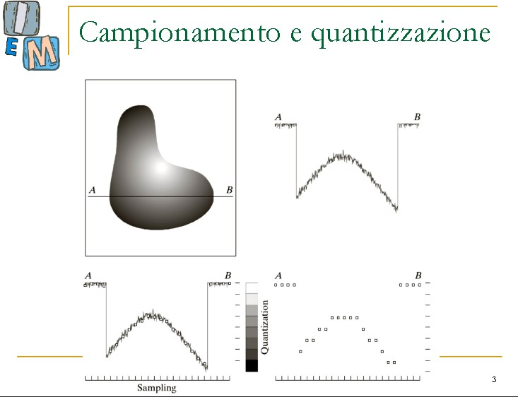

* campionamento dell'immagine-> colori registrati da A a B in grafico
* asse X = punti da A a B (infiniti??)
* asse Y = intensità (da 0(nero) a 255(bianco))
* infiniti -> ci sono anche reali nel grafico. dobbiamo farli diventare interi (colori effettivi)

* NOTA: nel grafico è continuo. dobbiamo renderlo DISCRETO/discontinuo

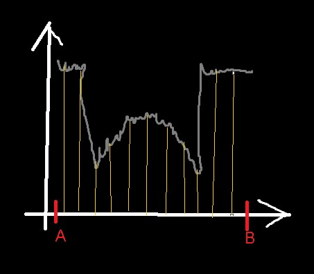

1. Renderlo discontinuo/numero finito di valori
   1. Per es. intervalli regolari
   2. devono rappresentare bene il segnale in bianco perché dopo dovremmo ricostruirlo da quel campionamento 
   3. Ci sono regole per fare un buon campionamento

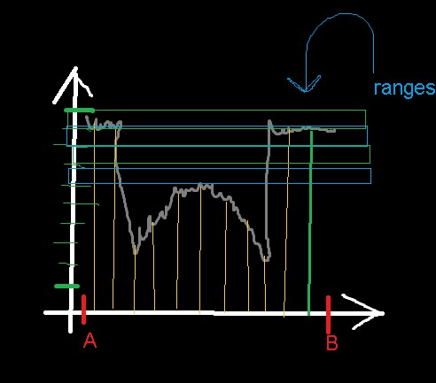

2. Scegliamo un range anche per l'asse Y (range tra 0 e 255)
   1. Tipo tra 255 e 250 è UN range chiamato R
   2. Da 249 a 245 è il range S
   3. (se ci sono decimali attuo un arrotondamento)
   4. Tutti quelli che cadono dentro una stessa fascia li "chiamo allo stesso modo" tipo li appiattisco su quel range

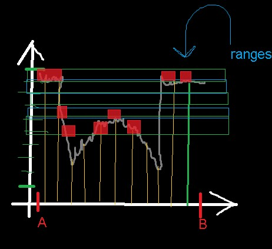

1. Bisogna scegliere bene il campionamento: se è "lasco" non riesce a rappresentare bene il segnale di partenza e quando lo devo rappresentare dai dati che ho registrato viene male 
   1. Es: Onda
2. Aumentare il numero di campioni aiuta
3. Ma rischio di prenderne anche troppi

4. Esempio: temperatura corporea della febbre
   1. Non una volta al giorno ma neanche ogni 15 min
5. Aliasing = fenomeno che viene fuori da un campionamento sbagliato (troppo BASSO, POCHI segnali)

***

## **Teorema del Campionamento di Shannon** 

* Teorema di Shannon VS teorema della compressione (sono DUE DIVERSI)

[Link wiki del campionamento di Shannon](https://it.wikipedia.org/wiki/Teorema_del_campionamento_di_Nyquist-Shannon)

* Dobbiamo specificare il Nyquist Rate = Per un segnale continuo e limitato il Nyquist Rate è il **doppio della frequenza più alta**

* Dominio delle frequenze (trasformazione tramite la trasformata Fourier)

* Per fare un campionamento che funzioni (una ricostruzione fedele) voglio sapere quanti campioni mi servono: il numero sarà più alto della frequenza di Nyquist. Quindi per fare un buon campionamento, ci vuole un numero maggiore del Nyquist rate, che a sua volta è il doppio della frequenza massima

        #n campioni >  NyqRate = 2*freqMax

* E' un maggiore STRETTO

*** 

### **Esempio: campionamento corretto**

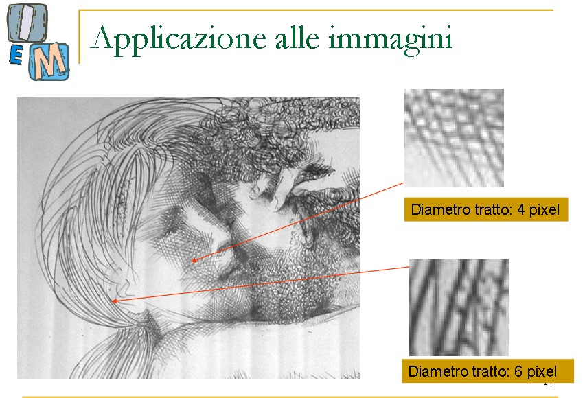

* Ci aspettiamo di partire da un segnale continuo: in realtà, se partiamo da una immagine digitale, partiamo già da una immagine campionata e non da un segnale continuo

* il numero dei campioni buoni quindi è 

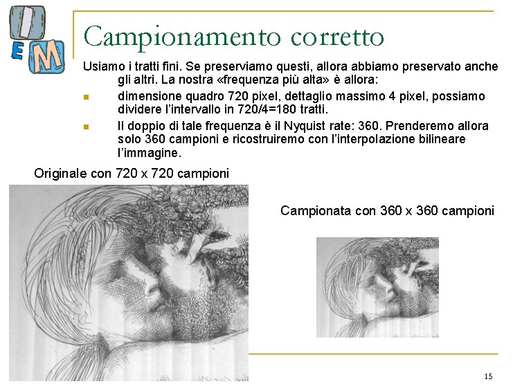

* immagine di partenza 720x720
  * Due tipi di tratto: 6 e 4 (***corrispondono alle onde della trasformata di FOURIER!!***)
  * Se faccio solo il ragionamento con il 6 non funziona: non si vede bene il 4
  * Quindi ragiono con quello più piccolo (DIVIDO per quello più piccolo)
  
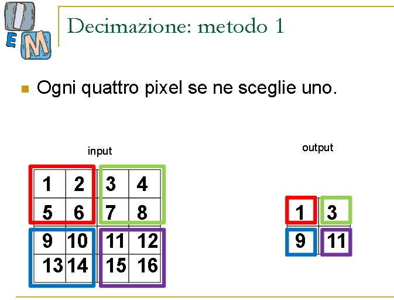

* per controllare la qualità ingrandisco e confronto: ok

### **Campionamento SBAGLIATO: divido per i tratti maggiori**

* mi aspetto che il tratto che ho 'overlooked' verrà peggio: lì ci stavano campioni più "fragili" che ho deciso di non tenere in considerazione

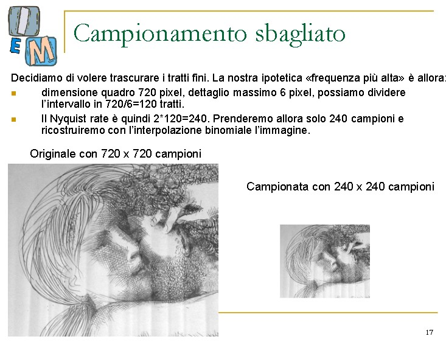

### **Campionamento TERRIBILE: campiono per un numero totale di campioni minore del NYQUIST RATE**

* Si perdono tutti i dettagli, il segnale viene male, "sembra n'altra cosa"
* 

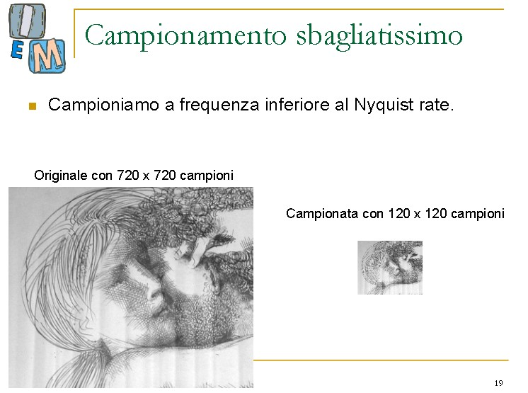

***

* Esempio di esercizio d'esame: "campionarla"
  * ci dicono di solito i tipi di tratti non occorre DI SOLITO fare la trasformata di fourier

***

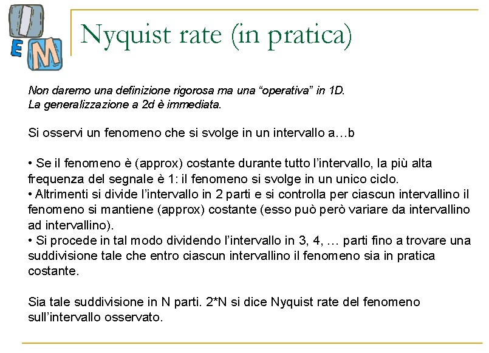

* Praticamente dipende da dove trovo una frequenza che in qualche modo si mantiene costante ?????
* La frequenza è tipo le onde della trasformata di fourier ed è legato al nyquist rate

***

### **ALIASING** 

* Quando trovo dei campionamenti ERRATI
* Aliasing OVVERO sbagliare campionamento

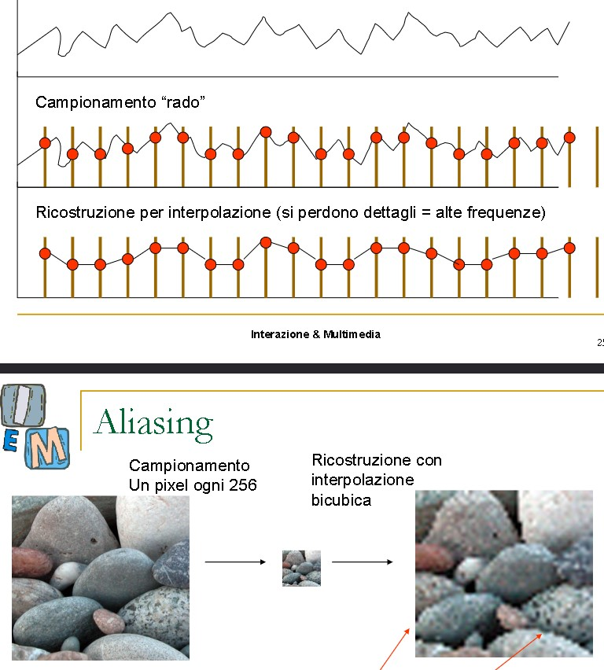

* Se c'è aliasing è soprattutto un problema se tratto righe o reticolati
* Aliasing particolare: 

* **Effetto Moiré**

* [LINK WIKI](https://en.wikipedia.org/wiki/Moir%C3%A9_pattern)

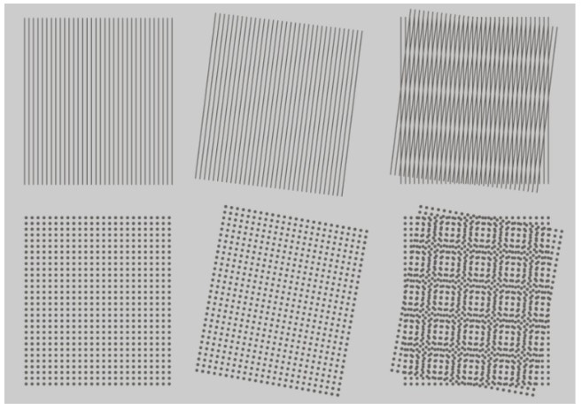

* Etimologia: è un tipo di seta che fa proprio questo effetto all'occhio

* Le linee oblique sono quelle della foto, quelle verticali sono del mio campionamento
* quello che viene fuori: quello a DX
* stessa cosa coi puntini: i due reticolati vanno in conflitto

* Come si risolve? Cambiando la frequenza di campionamento
* **E' comunque un aliasing** quindi vuol dire che il campionamento era di partenza sbagliato

* Aliasing dei video: effetto wagon wheel aliasing (ruota che gira al contrario) = aliasing temporale (sembra muorversi al contrario)
* Conosciuto al cinema 

***

## **QUANTIZZAZIONE** 

* E' una sorta di "Arrotondare" (NON SEMPRE) misure reali in valori discreti (più che arrotondamento, arrotondo ai range che scelgo, non al numero effettivo più vicino)

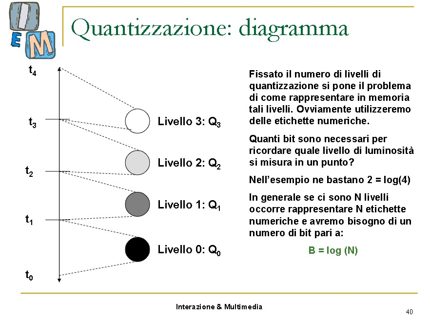

* Si può usare per la pixel art??
* Assomiglia all'idea di colore dello schema vettoriale (non raster)

* Esiste la quantizzazione uniforme e quella non uniforme
* La più comune quantizzazione non uniforme è quella logaritmica
* Questo è utile per schiarire zone (scelgo più campioni rappresentativi per le aree scure)

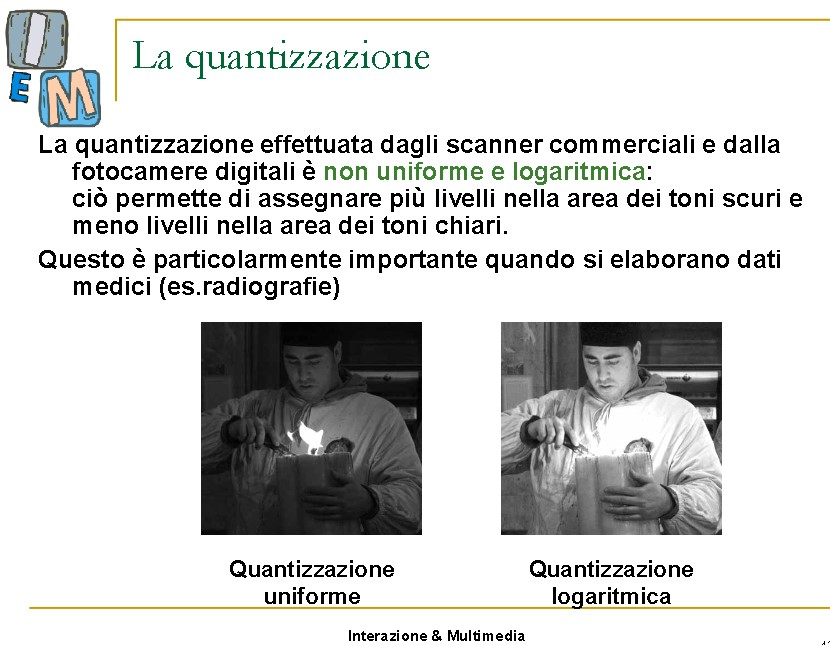

* E' anche importante capire in quanti pezzi quantizzare: non è la stessa cosa
* Se i rappresentanti sono pochi allora raggruppo pesantemente i colori
* Più sono i livelli, più è dettagliata l'immagine

***
### **Regole quantizzazione uniforme**

Da 0 a 255 --> N (intervallo precedente)= 256 
   >è comunque una RI quantizzazione: non vedremo mai una reale quantizzazione da reali a quantizzati perché non abbiamo dati continui

* **K** = numero di intervalli che voglio alla fine (intervallo successivo)
* *K deve essere più piccolo di N (obv)*  
* **L** = un livello

      Quantizzazione UNIFORME:  

                  L x K
            L' = ---------
                    N
* Uniforme = campioni uguali
* da 256 a 4 --> Sarà una immagine di soli 4 colori

      |---0----|-----1-----|-----2-------|----3-----|

### **Regole quantizzazione non uniforme**

da 0 a 255 --> N sempre = 256

* Poniamo K = 8 (dividiamo in 8 intervalli non tutti della stessa dimensione )

      L' = f(L, N, K)
         LOGARITMICA:

            log2(L) x K
      L' = -------------
              log2(N)

Quindi se log(256) = 8
Si semplifica con l'8 sopra

quindi log(L) <----

es: input = 120 --> log2(120) =  6, sarà nel range 6
    input = 240 --> log2(240) =  7, sarà nel range 7 
    