# **IeM - 12**

* no lez 17 e 21

* Itinere = 6 DICEMBRE due turni: 10:00 e 11:30 

## **Quantizzazione e campionamento** 

* (è comunque sempre RI-quantizzazione dato che trattiamo immagini già digitali)
  

        quantizzazione uniforme matlab

```matlab
% I = rgb2gray(imread('lena.jpg'));
I = imread('devoto.jpg');
figure,imshow(I, []); 
[m,n]=size(I); 

n=256;
k=8; 

Qu=round((double(I)*(k-1))/n);
figure, imshow(uint8(Qu), []), title('quantizzazione uniforme'); 

```

        quantizzazione NON uniforme matlab

```matlab
% I = rgb2gray(imread('lena.jpg'));
I = imread('devoto.jpg');
figure,imshow(I, []); 
[m,n]=size(I); 

n=256;
k=8; 

Qu=round((double(I)*(k-1))/log2(n));
figure, imshow(uint8(Qu), []), title('quantizzazione NON uniforme'); 

```

# **COLORE** 

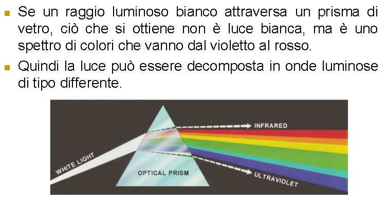

* Luce --> tante lunghezze d'onda
  * Corpuscolare e ondulare
  * Tra tutte le lunghezze d'onda c'è un piccolissimo range che possiamo vedere

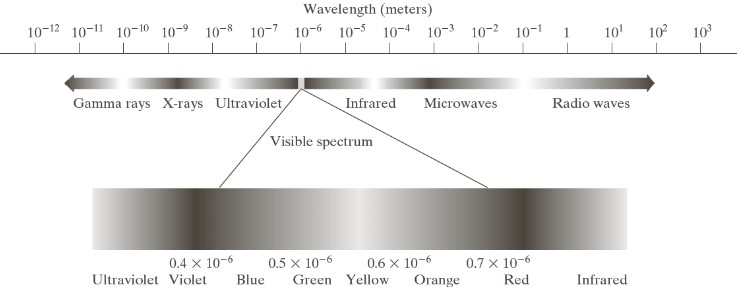

* Le bande non sono tutte della stessa dimensione 

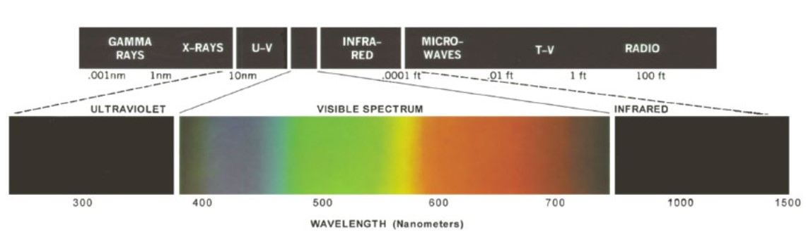

***

**RECUPERARE LEZIONE OCCHIO**

280 (round to 300) e 780 (round to 800)

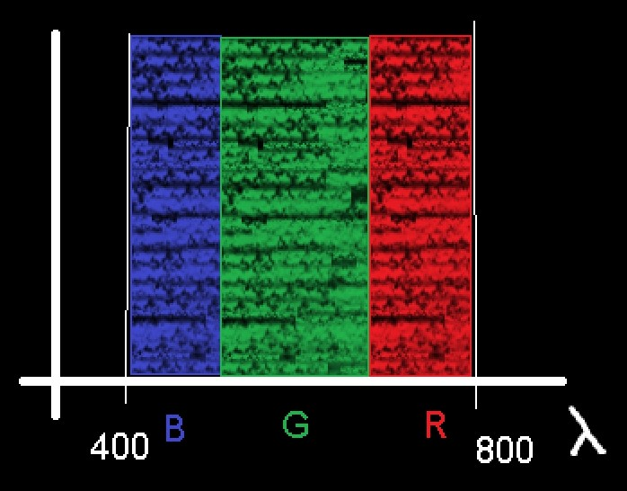

* I coni dell'occhio sono di tre tipi: 
  * Sensibili alle lunghezze d'onda corte, medie, lunghe

* Spettro di assorbimento dei coni --> slide del dipartimento di fisica

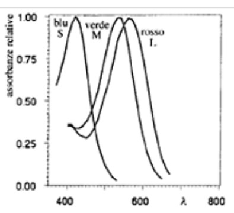

* Non parte da 0 e non arriva a 0
* ***Curve di andamento***

* Standard delle lunghezze d'onda e standard dei picchi massimi di R G B
  * Cambiando i picchi cambia lo standard

* STANDARD **CIE** 
  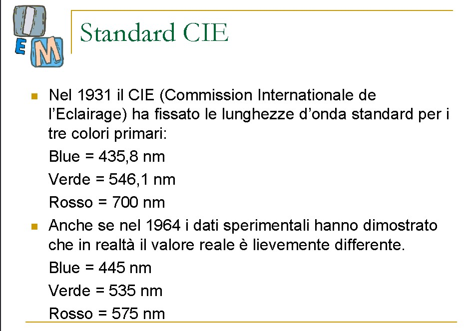
  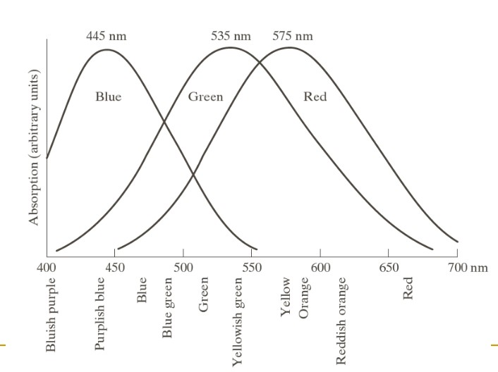
  * Valori di lunghezza d'onda massimo per la risposta dei coni agli stimoli del blu verde e rosso
  * Blu = 445 nm
  * Verde = 535 nm
  * Rosso = 575 nm

* Il verde nel grafo è una campana gaussiana su tutto lo spettro del visibile, quindi il nostro occhio è più sensibile al verde!

* Motivo per cui i tessuti della sala operatoria sono in verde --> meno stimoli all'occhio e più concentrazione

* Tre coni e tre colori 
* Teoria = tutti i colori dello spettro del visibile si possono ottenere unendo i tre colori dello spettro del visibile
* TEORIA DEL TRISTIMOLO
  * questa ipotesi in realtà è **FALSA**: ci sono dei colori che, se questa teoria fosse vera, non potremmo vedere

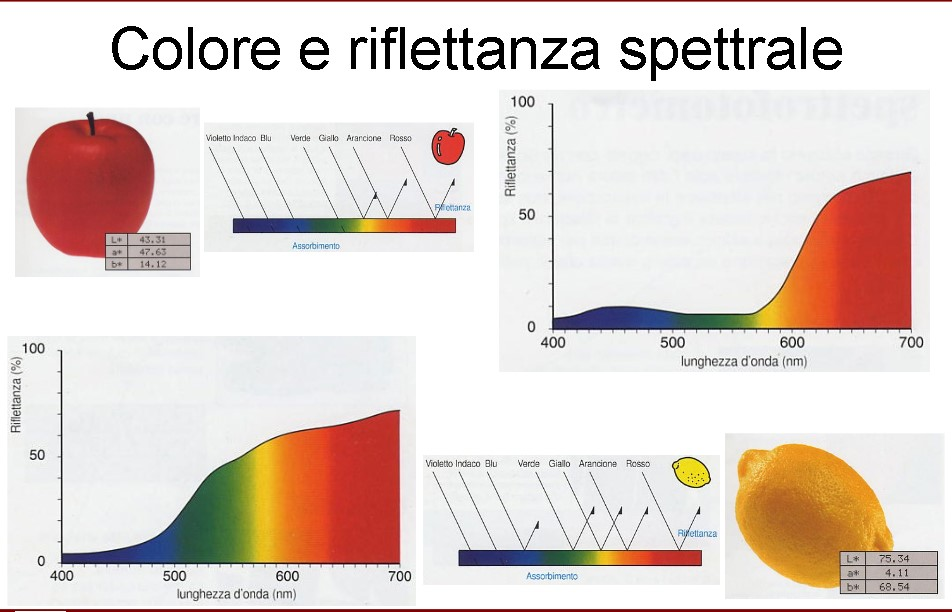

* Le frequenze riflesse da un oggetto sono quelle che poi arrivano all'occhio (ed è il colore che vediamo sull'oggetto)

* L'origine (del grafico) non parte da zero --> facciamo partire le lunghezze d'onda da 400

* Grafico della mela --> lo spettro del colore che la mela riflette e che arriva all'occhio

* Intersezione -> tra lo spettro di assorbimento (da parte dell'occhio/dei coni) del blu e lo spettro riflesso dall'oggetto ----> intersezione dell'area: E' un **INTEGRALE** 
* L = la curva dell'oggetto
  * z = Integrale[380->780]( L[e, λ] z[λ]d[λ])

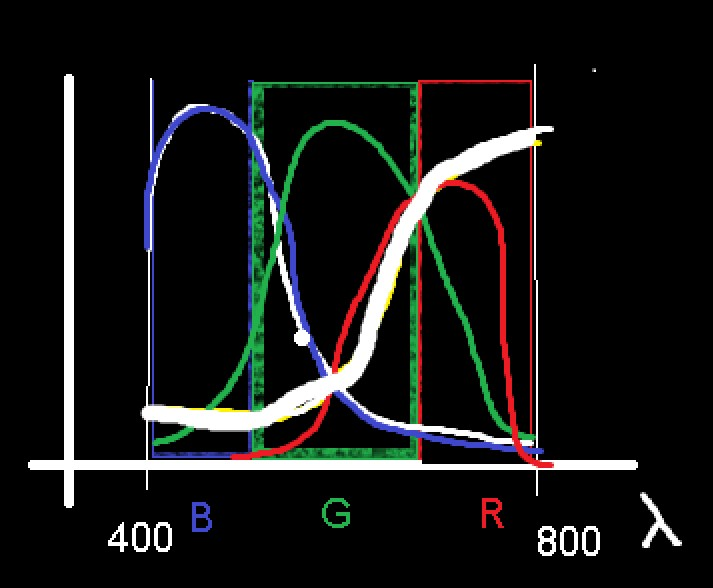

**Spazio del colore (X, Y, Z) (MAIUSCOLO)**

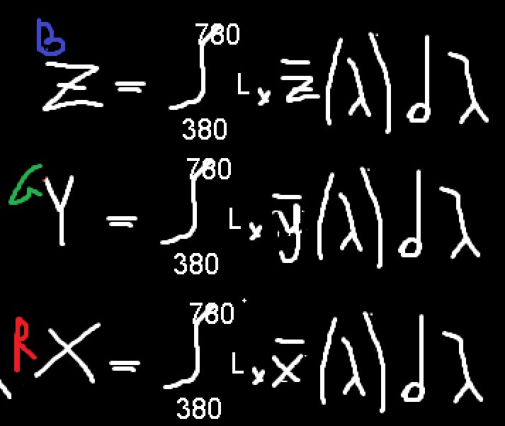

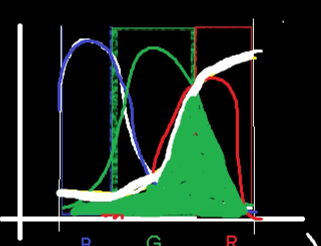

* MA non abbiamo tenuto in considerazione l'illuminante

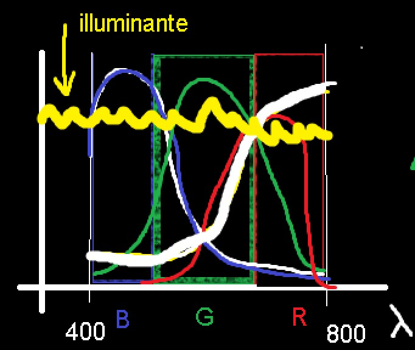

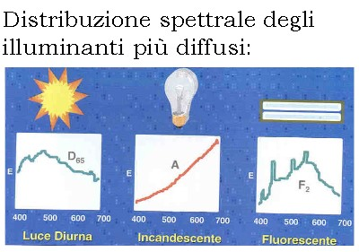

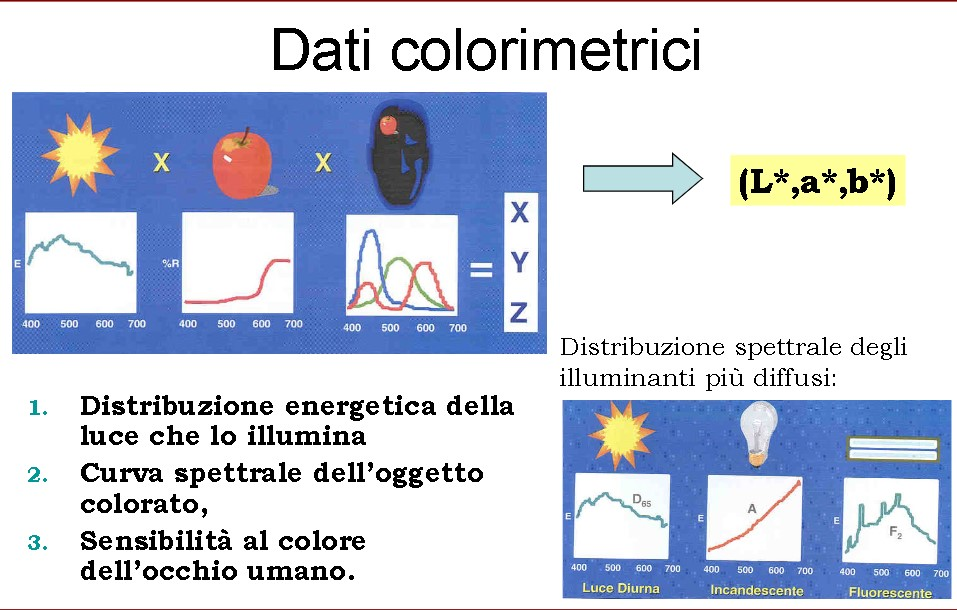


* **SPAZI DI COLORE**
* Terna (X, Y, Z) --> tristimolo 
  * Da questo si parte per costruire tutti gli altri (nato dal nostro sistema visivo)
* Terna (R, G, B)
 

***


* Osservatori standard 
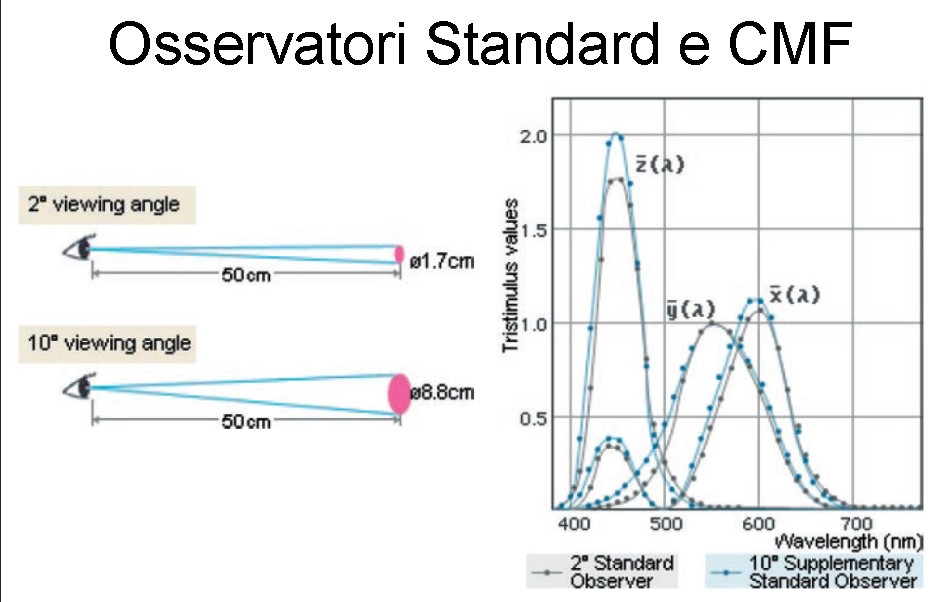

* Cose che cambiano la percezione del colore 

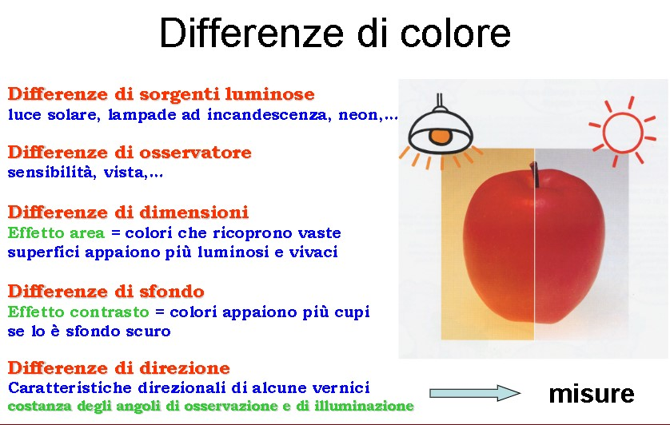

***

* Stabilire il colore di un oggetto: 
  * Per comparazione (geologia) -> Tavole Munsell

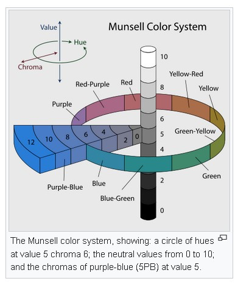
<br> <br> 

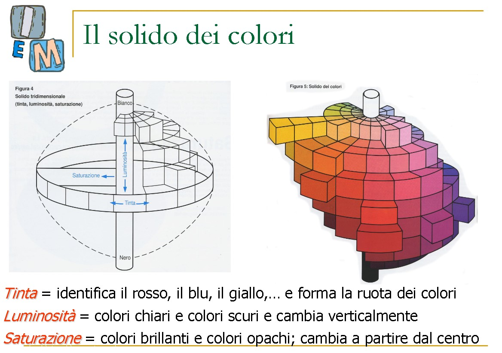

* Ma in ambienti tipo moda o cosmetici serve una strumentazione che stabilisca un colore decisivo e "oggettivo"

* Spettrometri e colorimetri
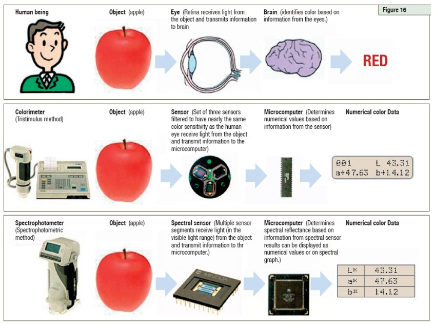

* Es: [rosso corsa ferrari](https://en.wikipedia.org/wiki/Rosso_corsa)

***

## **Spazio di colore (x, y, z) (minuscolo)**

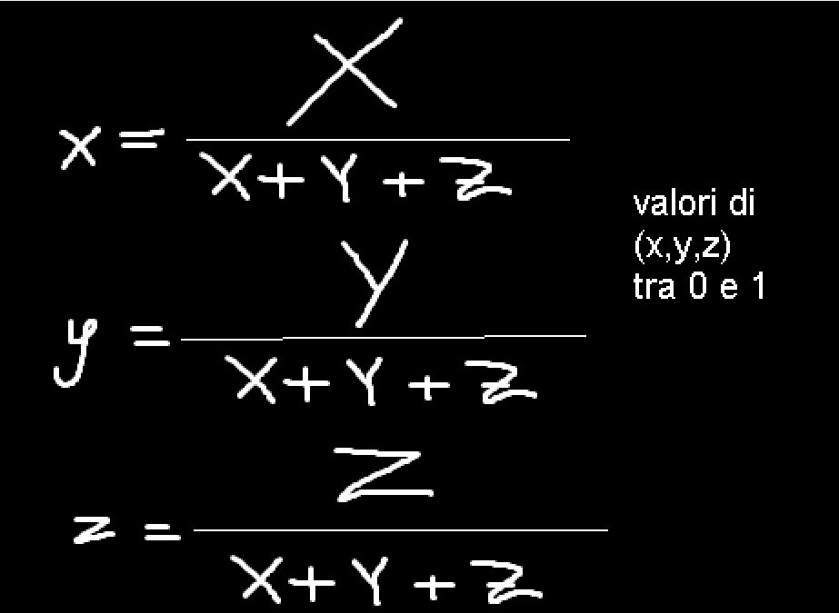

Posso rappresentare x y e z in 2D (x e y, sapendo di poter calcolare la Z)

* (X,Y,Z) --> rappresenta UNA singola lunghezza d'onda? Un punto?

### **DIAGRAMMA CROMATICO CIE**

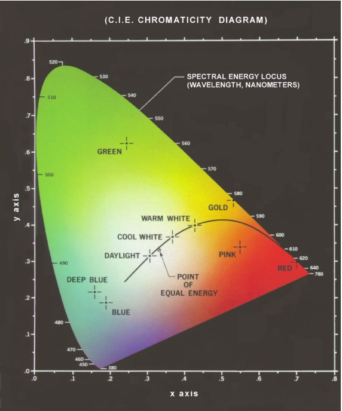

* E' una sezione (in realtà dovrebbe essere in 3D)
* nel bordo ci sono tutte le lunghezze d'onda
* Lungo il bordo non hanno bianco -> colore "puro"
* Ha una forma strana perché parte da frequenze strane (non da 0, frequenze visibili etc)

* diagramma ottenuto attraverso x y z minuscoli in modo da poter portare il range tra 0 e 1 --> la z c'è ma non la disegnamo in 2D però può essere calcolata


* Dimostrare che la teoria del tristimolo NON sia corretta
  * Prendiamo rosso blu e verde come vertici e costruiamo un triangolo:
  * dentro il triangolo ci stanno tutti gli ottenibili con RGB
  * Tutti i colori fuori --> non li possiamo ottenere?
  * Quelli che possiamo ottenere con la stampa sono ancora meno rispetto agli ideali RGB

* Detto diagramma a vela o a lingua (non è in ogni caso un disegno regolare)

* Però il RGB considerato così --> stiamo considerando i PICCHI, ma rendendo i picchi invece "aree di influenza" allora è possibile rappresentare con RGB lo spettro del visibile interamente
* L'occhio vede tutto il visibile perché l'occhio non vede attraverso il diagramma semplificato dei picchi, non con singole lunghezze d'onda, ha campane molto larghe e per questo riesce a vedere
* Quindi il rosso non è un punto ma un'area

* infatti la curva dello spettro degli oggetti non sono mai a zero ma hanno sempre delle "code" --> cosicché da potersi muovere attraverso tutto lo spettro del visibile

***

### **Spazi di colore**

  * (x, y, z) [minuscoli] VISTO
  * (X, Y, Z) [MAIUSCOLI] VISTO 
<br><br><br>

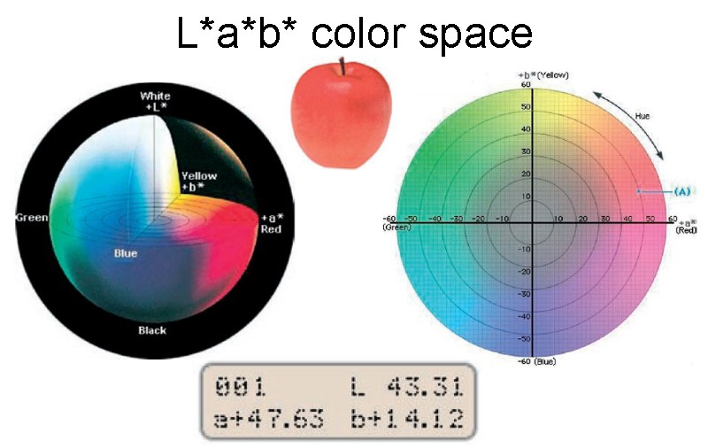

     (L*, a*, b*)

* Calcolato in modo che venisse fuori una **SFERA**
* Percettivamente uniforme: La distanza dei due colori nello spazio corrisponde ad una differenza percettiva 
  * Prendendo due punti nella sfera --> posso prendere la distanza euclidea tra i due punti e quella distanza spaziale equivale alla distanza cromatica percepita!
  * A distanza fisica corrisponde distanza percepita
  * L'unico spazio di colore che sia percettivamente uniforme
* Il più usato nel mondo della fisica

* Es: Rosso Ferrari 

    (L1*, a1*, b1*) --> rosso ferrari 
    (L2*, a2*, b2*) --> colore che devo confrontare

    FACCIO DISTANZA GEOMETRICA 

    sqrt((L1*-L2*)^(2) + (b1*-b2*)^(2) + (b1*-b2*)^(2))

* Questo è l'errore ----^
  * Quale sarebbe la "massima differenza possibile" o "preferibile"?
  * Per un rosso ferrari = 1% --> è un numero molto piccolo 

* Nei cosmetici la tolleranza è più alta: circa 10%