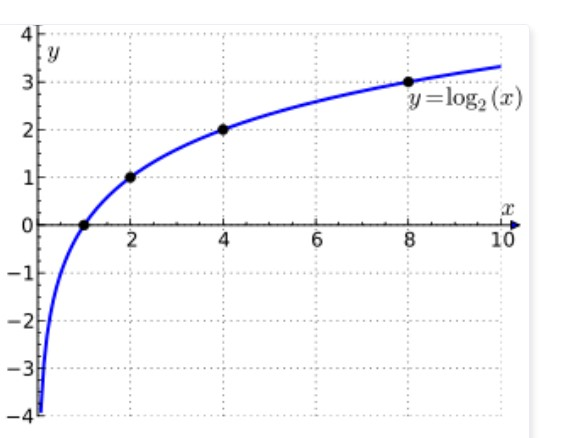
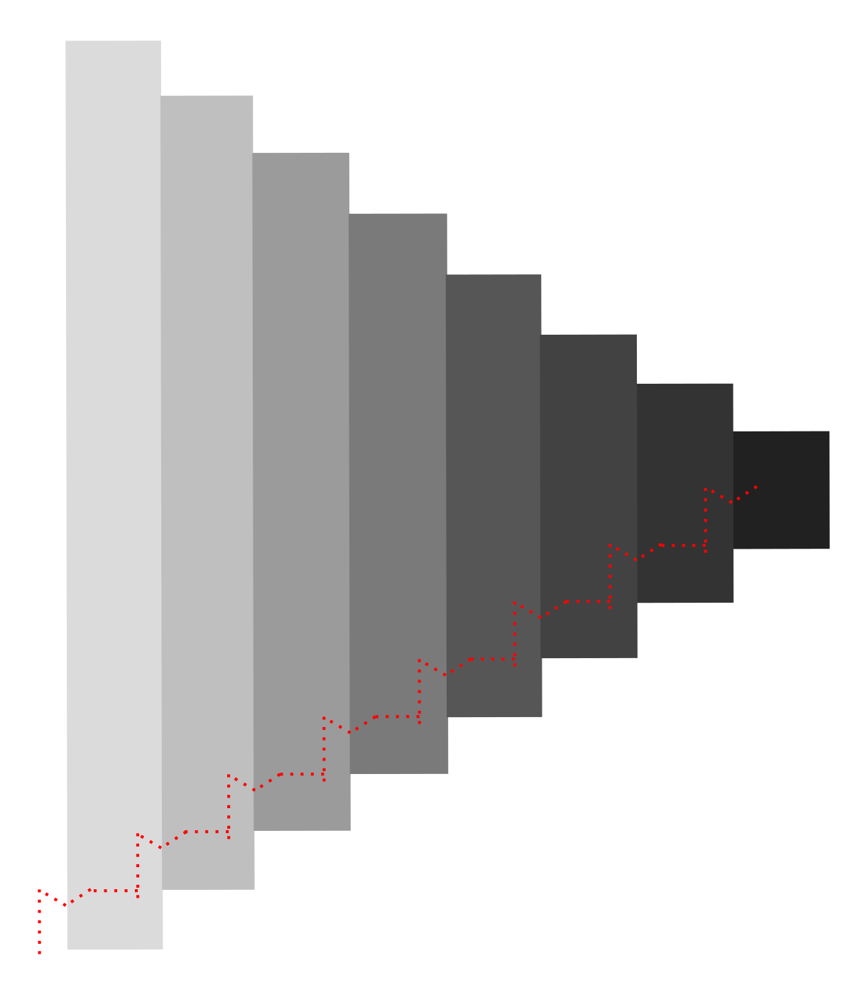

# IeM - 2

## **Sistema di percezione**

### **Intensità percepita**

E' una funzione logaritmica della luce che arriva dentro l'occhio 
Una parte della luce viene assorbita dall'oggetto -> una parte viene riflessa
quella riflessa viene captata dagli occhi --> ciò che noi vediamo


^-I colori scuri avranno una differenza maggiore fra di loro rispetto ai colori chiari?
Il sistema visivo tende a distinguere le cose scure rispetto alle cose chiare

[^1] Più sensibile alle cose scure (c'è un motivo)

Log --> Per esempio, se diamo una tac a una funzione log, la differenza tra i pixel scuri viene accentuata
Applicare logaritmo a immagine -> per accentuare dettagli

### **Range dinamico**

range della visione: oggetti scuri o chiari; il sistema visivo non opera contemporaneamente su tutto il range, ma solo su una porzione di esso (--> occhio **che si abitua alla luce/buio**)

Una macchina fotografica di solito fa come l'occhio --> Però ce ne sono alcune (**HDR**--> high dynamic range) che riescono ad allargare la zona memorizzabile / il range si allarga

Fanno quello che l'occhio non può fare: ne scattano TRE: con tre range diversi, e un algoritmo li mette assieme

Messe assieme l'illuminazione sembra omogenea  (ES: vetrata luminosa dentro una chiesa in penombra)

### **Bande di Mach** (1865) -- Illusione ottica



Le bande di mach salgono in maniera costante e i rettangoli sembrano "ombreggiati"<br>
Il contrasto visivo --> Quando ci sono cose con **molto contrasto*** fra di loro (opporre colore scuro a uno nettamente più chiaro)
Se il salto è fatto con colori con luminosità diversa --> La variazione SEMBRA diventare da più chiaro a più scuro<br>
(Mentre i rettangoli continuano ad essere a tinta unita)<br>

### **CONTRASTO SIMULTANEO**

A parità di oggetto interno, "conta" la cornice esterna e il suo contrasto con l'oggetto <br>
[^1]: (è una evoluzione utile per evitare pericoli o oggetti etc)

## **RAPPRESENTAZIONE DI UNA IMMAGINE**

Bisogna poterla RAPPRESENTARE digitalmente<br>
--> Quindi scrivere "in formula" il sistema visivo

**i** = luce incidente (raggi che arrivano sull'oggetto) DALL'ILLUMINANTE
**r** = luce riflessa dall'oggetto colpito dai raggi

La funzione per descrivere l'immagine trattenuta dalla macchina fotografica = 

```
f(x,y) = i(x,y) * r(x,y)
```

Raggi del sole, neon, etc --> sono ILLUMINANTI

Per questo negli esperimenti si usa una cabina luce, dove conosco perfettamente le proprietà dell'illuminante

Il quantitativo di luce **i** varia a secondo di tanti fattori

```
i =
0 < i(x, y) < INFINITO

r = 
0 < r(x, y) < 1
```
Il nero / zero perfetto non esiste in natura, né il bianco perfetto (non ci sono UGUALI in questa espressione)

(**r** e **i** sono diversi)

Giornata luminosa = circa 90000 lm/m<sup>2</sup><br>
Giornata nuvolosa = circa 10000 lm/m<sup>2</sup><br>
Luna = circa 0.1 lm/m<sup>2</sup><br>
Edificio commerciale = circa 1000 lm/m<sup>2</sup><br>

Il materiale che assorbe più luce è il velluto nero. (0.01); la neve è tra le cose più riflettenti (0.93). 

Ogni illuminante ha un codice.

luce del sole = d65 (daylight 6500K°), l'illuminante più forte che si tiene in considerazione

f(x, y) --> qual è il numero massimo?? Problematico se tengo in considerazione d65 e la neve come riflettente

quindi devo COMPATTARE questi numeri in un range INFINITO e INTERO

Quindi l'immagine viene discretizzata quando viene memorizzata dentro la Camera

Bisogna astrarre / applicare algoritmi

**CAMPIONAMENTO e QUANTIZZAZIONE**

--> La immagine sarà una MATRICE, ogni elemento ha un numero (sarà un pixel)<br>
Quindi ragiono in maniera RASTER<br>

***

# **IMMAGINI VETTORIALI E RASTER** 

Alla base --> comunque una matrice<br>
considerare ogni cella della matrice come un pixel<br>

Possiamo organizzare i dati in due modi: le coordinate x,y di f(x, y) rappresentano le righe e le colonne della matrice in questione <br> 
Specificare il colore per ogni singolo pixel a seconda delle coordinate<br>
Es = (1,1)= blu, (1, 2)= rosso, (1, 3) = verde<br>
Questa organizzazione si chiama ***RASTER***<br>

La versione ***VETTORIALE***, invece<br>
Scompongo la figura in VETTORI (dal punto x al punto y disegnare un segmento, e specifico il colore di quel segmento)<br>
*(Ps1 graphics go brrrrr)*<br>
Per ogni segmento specifico da dove parte e dove finisce: posso disegnare qualunque immagine scomponendola in molti vettori.<br>

Ma nel vettoriale è possibile **ingrandire** l'immagine all'infinito tramite una moltiplicazione; ingrandendo quella **raster** invece si inizia a vedere "sfocato" ("spixellato")<br>

Il **vettoriale** si usa nella ***GRAFICA***. Ad esempio, le lettere dell'alfabeto sono vettoriali nei pdf, si possono ingrandire senza perdere qualità. (anche cartoni animati)

E' semplice per un disegno semplice ma trasformare una foto per è molto complicato e il file diventa estremamente pesante.
(Spesso nelle immagini molto grandi, il testo è fatto in vettoriale e la immagine in raster)

I pro del **raster** = 
1. Intuitivo
2. Il più diffuso
3. Quello che si presta meglio a rappresentare tipo foto etc

--> Autocad e Adobe Illustrator gestiscono le immagini vettoriali, software tipo Photoshop possono gestire le raster

La grafica vettoriale funziona meglio se possiamo CHIUDERE le forme (tipo in forme "primitive") (es: CAD, GIS (mappe), Animazioni)

Il **vettoriale** non perde di qualità se ingrandisco, ma le foto vengono peggio

Per ottenere la stessa qualità di un raster un vettoriale ci vuole un sacco di spazio

Il PDF può gestire immagini vettoriali

--> utilizzeremo formato RASTER

## Pixel 

= picture element
(un elemento della matrice si chiama pixel SOLO se rappresenta il colore dell'immagine)

# Rappresentazioni immagini

Una matrice non è l'unico modo di rappresentare una immagine: possibile vedere l'immagine come immagine e basta(????)

Un terzo modo = attraverso un diagramma cartesiano dove l'origine è l'angolo in alto a sinistra, la X va dall'origine a Sud, e la y dall'origine a Est; e un terzo asse che va verso l'alto (in 3D; più il valore è alto più il colore è chiaro)<br>
FOndamentalmente diventa un *altorilievo* (versione 3dimensionale)

Il valore contenuto della cella della matrice è il valore di z (il valore di grigio nel valore (x, y))

Ciò serve per usare filtri e cose in 3D

Queste matrici partono da (1,1) e non da (0,0)

Bit utilizzati per un singolo pixel = dipende dalle sfumature di grigio.

es: 1 solo bit = immagine bianco nero (1 = bianco, 0 = nero)

8 bit per pixel = nella posizione (i,j) ci sarà un valore compreso tra [0, 255] (0 = nero, 255 = bianco)

24 bit per pixel = immagine a colori. <br>
Si organizza in terne = **RGB** ([0-255], [0-255], [0-255])

Posso utilizzare tre matrici diverse, ognuna contiene gli elementi del primo, secondo, e terzo elemento della terna.

Si scompongono le componenti in rosso, verde, e blu.
--> Nasce dall'osservazione di come è fatto l'occhio umano

Ogni singola componente è IN SCALA DI GRIGIO --> perché 8 px = valore compreso [0, 255] ("Falsi colori")

(nelle 3 matrici di "falso colore", dove il colore corrispondente è più alto o presente in concentrazione maggiore, il valore è più alto e quindi nella immagine in grigio corrispondente )

Nella rappresentazione 3D

```matlab
I=double(imread('lena.jpg'));
figure, imshow(uint8(I), []);

R=u
```