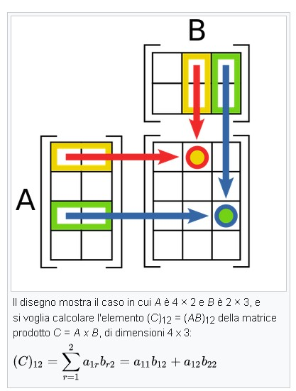
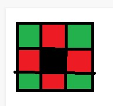
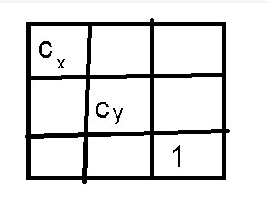
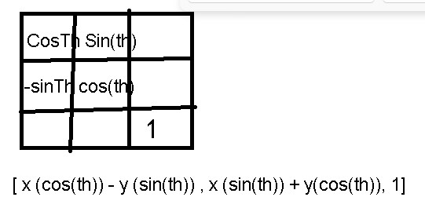
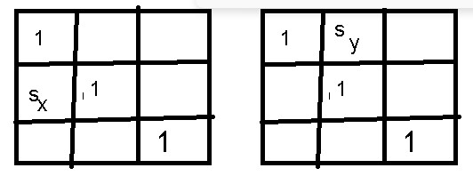
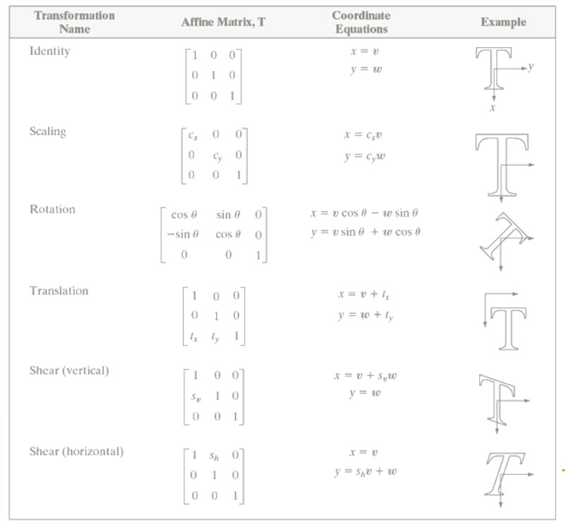

# ***IeM - 3***

## **Operazioni su immagini e matrici**

--> Secondo il concetto di considerare una immagine come una matrice (**A**) (RASTER)

Operazioni su immagini: avendo un'altra matrice (**B**) di uguali dimensioni

### **Somma tra due matrici** 
    -> cella a cella A(1,1)+B(1,1) = C(1,1)  etc 

ma problemi -> posso andare oltre range (255), non ha "senso" il risultato se entrambe rappresentano immagini (in scale di grigio)

### **Prodotto tra matrici** (ripasso)

(Riga per colonna)



*Il risultato avrà il numero di righe della prima e num di colonne della seconda*

Esiste anche il prodotto puntuale (che funziona come la somma, cella a cella); non è un vero prodotto tra matrici, ma anche questo non da' significato pratico per adesso, ma può servire per applicare cose

### **Vicini di un Pixel**

Considerando una matrice 3x3; 
Il pixel di coordinate (2,2) (al centro) ha tanti pixel vicini: la distanza tra un pixel e quelli a nord/sud/est/ovest è 1

La distanza euclidea = sqrt( (2-2)<sup>2</sup> + (1-2)<sup>2</sup>)

La distanza tra un pixel e quello immediatamente diagonale ad esso (2,2) e (1,1) è ***radice di 2***

I pixel nord/sud/est/ovest sono i più prossimi e sono detti N<sub>4</sub>
Gli 8 vicini sono detti N<sub>8</sub>



Ai bordi si fa un altro tipo di calcolo --> i bordi non hanno 4/8 vicini ma prendo quelli che ho

## **OPERAZIONI AFFINI**

Sono operazioni che si fanno sulle matrici che non modificano il **valore** del pixel --> MA LA SUA **POSIZIONE**

ad esempio la rotazione dell'immagine, la traslazione, lo "stiracchiamento"

In realtà non è così definito --> possono avvenire arrotondamenti, perdita di informazioni, due pixel che dovrebbero mettersi nello stesso punto, conflitto etc

Ad esempio: se in una immagine ho due rette parallele, dopo una operazione affine applicata all'immagine, esse continueranno ad essere parallele

Ex: matrice 5x5 --> **Identità** 
    Si prende il singolo elemento della matrice, si mette in un vettore -->[x, y, 1]--> e questo si va a moltiplicare con la matrice identica 3x3

### **Identità**

data una matrice, voglio applicare una operazione affine (identità, riscalaggio, rotazione, [...])<br>
L'operazione identità --> Abbiamo una matrice identica 3x3<br>
faccio scorrere il ciclo per la matrice di partenza, faccio il prodotto mettendo i valori [i, j, 1] in un vettore e moltiplico con la matrice identica --> il pixel (1,1) andrà a finire nella cella (1,1)<br>
Il valore non cambia --> solo le COORDINATE in cui il valore si troverà<br>

**Matrice identica**: 1 nella diagonale e 0 in tutto il resto (è una matrice quadrata)

{   v = x
{   w = y

***

### **Riscalaggio**



Cx e Cy --> di quanto scalo per l'asse x e l'asse y --> se è minore di 1 rimpicciolisco l'immagine, se è maggiore ingrandisco<br>
Se Cx e Cy non sono uguali l'immagine sarà più "stretchata" su un asse rispetto che su un altro<br>

Chiedo ogni volta dove va a finire ogni volta il pixel in input

Nella matrice di output -->

{   v = x Cx
{   w = y Cy

***

### **Rotazione** 



gira rispetto ad un perno?? rispetto all'angolo Theta

{ v = x cos(th) - y sin(th)
{ w = x sin(th) + y cos(th)

***

### **Traslazione**

Si spiega perché la matrice delle operazioni affini è 3x3 e non 2x2!

# CONTROLLARE SLIDE PER MATRICI
# SLIDES x,y e v,w sono invertite rispetto ad appunti

{ v = x + t <sub>x</sub>
{ w = y + t <sub>y</sub>

***

### **"Stiracchiamento" / Shear verticale e orizzontale**



***



***

## **DIMOSTRAZIONE IN MATLAB**

### ***riscalaggio***

```matlab

    clear all
    close all %%chiudere tutte le finestre precedenti, evitare errori etc

    I=rgb2gray(imread('len.jpg')); %%applico funzione che rende in scala di grigio
    figure,imshow(I,[]);    %%mostra immagine I

    [m, n] = size(I); %%%assegno al numero di righe e di colonne la grandezza dell'immagine stessa

    cx = 2; 
    cy = 2; 

    S=[cx 0 0; 0 cy 0; 0 0 1 ]; %%%creare matrice in matlab

    for i=1:m
        for j=1:n

            vett = [i j 1] * S; %%%il vettore
            v = vett(1,1); 
            w = vett(1,2); 
            O(v,w) = I(i,j); 

        end
    end

    figure, imshow(O,[]); 

```

Ingrandendo l'immagine si creano dei "buchi" nella immagine = degli spazi dove non abbiamo assegnato nessun valore<br>
Rimpicciolendo --> valori con la virgola --> non possiamo accedere nella matrice a posizioni non intere<br>
    Quindi arrotondo (all'intero più grande --> ma se è 0, nuovamente mi da errore (non c'è l'indice 0))<br>
Includo "if v>0 & w>0" <br> etc
In questo momento i pixel in conflitto vengono risolti sovrascrivendo con il pixel ultimo arrivato

***

### ***rotazione***


```matlab

    clear all
    close all %%chiudere tutte le finestre precedenti, evitare errori etc

    I=rgb2gray(imread('len.jpg')); %%applico funzione che rende in scala di grigio
    figure,imshow(I,[]);    %%mostra immagine I

    [m, n] = size(I); %%%assegno al numero di righe e di colonne la grandezza dell'immagine stessa

    cx = 2; 
    cy = 2; 
    theta= 30; 

    S=[cx 0 0; 0 cy 0; 0 0 1 ]; %%%creare matrice in matlab
    R=[cosd(theta) sind(theta) 0; -sind(theta) cosd(theta) 0; 0 0 1]; 


    for i=1:m
        for j=1:n

            %% riscalaggio
            %% vett = [i j 1] * S; %%%il vettore
            %% v = vett(1,1); 
            %% w = vett(1,2); 
            %% O(v,w) = I(i,j);

            %% rotazione
            vett = [i j 1] * R; %%%il vettore
            v = vett(1,1); 
            w = vett(1,2); 
            O(v,w) = I(i,j); 

        end
    end

    figure, imshow(O,[]); 

```

Matlab usa in radianti --> quindi devo correggere e mettere cosd invece di cos

La rotazione utilizza l'angolo superiore come perno

Anche qua --> zone in nero non sono "uscite" come valori

Con un angolo pari a 170 per esempio --> l'immagine è andata fuori del tutto e non è visualizzabile


### ***traslazione***


```matlab

    clear all
    close all %%chiudere tutte le finestre precedenti, evitare errori etc

    I=rgb2gray(imread('len.jpg')); %%applico funzione che rende in scala di grigio
    figure,imshow(I,[]);    %%mostra immagine I

    [m, n] = size(I); %%%assegno al numero di righe e di colonne la grandezza dell'immagine stessa

    cx = 2; 
    cy = 2; 
    theta= 30; 

    tx = 10; 
    ty = 10;

    S=[cx 0 0; 0 cy 0; 0 0 1 ]; %%%creare matrice in matlab
    R=[cosd(theta) sind(theta) 0; -sind(theta) cosd(theta) 0; 0 0 1]; 
    T= [1 0 0; 0 1 0; tx ty 1];
    


    for i=1:m
        for j=1:n

            %% riscalaggio
            %% vett = [i j 1] * S; %%%il vettore
            %% v = vett(1,1); 
            %% w = vett(1,2); 
            %% O(v,w) = I(i,j);

            %% rotazione
            %% vett = [i j 1] * R; %%%il vettore
            %% v = vett(1,1); 
            %% w = vett(1,2); 
            %% O(v,w) = I(i,j); 

            %% traslazione
            vett = [i j 1] * T; 
            %
            %
            %


        end
    end

    figure, imshow(O,[]); 

```

Se trasla in negativo l'immagine sarà tagliata


### ***shear***


```matlab

    clear all
    close all %%chiudere tutte le finestre precedenti, evitare errori etc

    I=rgb2gray(imread('len.jpg')); %%applico funzione che rende in scala di grigio
    figure,imshow(I,[]);    %%mostra immagine I

    [m, n] = size(I); %%%assegno al numero di righe e di colonne la grandezza dell'immagine stessa

    cx = 2; 
    cy = 2; 
    theta= 30; 

    tx = 10; 
    ty = 10;

    sx = 2; 
    sy = 2; 

    S=[cx 0 0; 0 cy 0; 0 0 1 ]; %%%creare matrice in matlab
    R=[cosd(theta) sind(theta) 0; -sind(theta) cosd(theta) 0; 0 0 1]; 
    T= [1 0 0; 0 1 0; tx ty 1];
    Shx = [1 0 0; sx 1 0; 0 0 1]; 
    Shy = [1 sy 0; 0 1 0; 0 0 1]; 
    


    for i=1:m
        for j=1:n

            %% riscalaggio
            %% vett = [i j 1] * S; %%%il vettore
            %% v = vett(1,1); 
            %% w = vett(1,2); 
            %% O(v,w) = I(i,j);

            %% rotazione
            %% vett = [i j 1] * R; %%%il vettore
            %% v = vett(1,1); 
            %% w = vett(1,2); 
            %% O(v,w) = I(i,j); 

            %% traslazione
            vett = [i j 1] * T; 
            v = round(vett(1, 1)); 
            w = round(vett(1,2)); 
            if v>0 & w>0
            %


        end
    end

    figure, imshow(O,[]); 

```


Dato che il prodotto riga per colonna non è commutativo, R x T e T x R daranno risultati diversi

### **FORWARD MAPPING**
--> Può creare dei buchi

### **INVERSE MAPPING** 
prima--> [x y  1] * T = [v  w  1]

adesso voglio ricavare x y e 1:

[x y 1] = [v w 1] * inv(T)

Facendo scorrere i pixel della matrice di output --> moltiplico per la matrice inversa ?

ma in questo modo rischiamo di uscire dai confini [0, 255]

Scaling con inverse mapping--> non si creano i buchi

