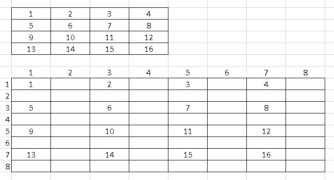
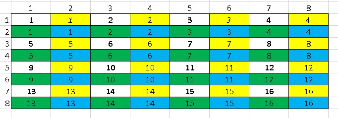
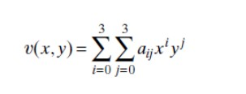

# **5 - IeM**

## **INTERPOLAZIONE**

"Prevedere" dei valori che non sono presenti. Controlla che succede nell'**intorno** del pixel e in base ai valori che sono presenti, assegna valori.

### ***valori non assegnati***

--> Ingrandimento dell'immagine (perché è semplice da spiegare; ma funziona in qualunque operazione in cui si vanno a formare dei buchi)

Zoom -> Zoom in vs Zoom out

#### **ZOOMING IN**

-->Doppio delle righe e doppio delle colonne (i pixel sono quadruplicati)
La singola dimensione raddoppia --> quindi i pixel sono QUADRUPLICATI 



3 interpolazioni: 
1. **NEAREST NEIGHBOR**, anche detta **REPLICATION**
    Ogni volta copio il vicino più prossimo<br>
    parto da quello subito dopo il primo (1,1) a destra (1,2)
    e a seguire tutti quelli verso destra<br>
    Poi quello sotto (1,1) --> (2,1) e tutti quelli sotto
    E mo? Decido di prendere quelli in alto a sinistra<br>
    
    

    -->Non ho usato formule<br>
    -->Ho usato solo colori della immagine di partenza<br>
    -->Ma l'effetto è tipo a zigzag o scalettatura, rende un pixel tipo piastrella<br>
    Abbiamo replicato e mantenuto il contrasto di prima<br>

***

2.  **BILINEARE**<br><br>
    Qua l'effetto è sfocato: attenua i "salti" e i contrasti perché inserisce valori intermedi<br>
    Bisogna fare calcoli<br>
    La funzione è ***v(x,y) = ax + by + cxy + d***<br> 
    (è lineare rispetto a 'x' e 'y')<br>
    Nella prima fase, gli unici che possiamo trovare sono quelli che hanno 4 valori definiti (4 incognite: a, b, c, d); quindi riempiamo prima quelli "in diagonale"<br>

    **CALCOLARE VALORI DELL'INTORNO**<br>
    v(1,1) = 1 = a + b + c + d = 1<br>
    v(1,3) = 2 = a + 3b + 3c + d<br>
    v(3,1) = 5 = 3a + b + 3c + d<br>
    v(3,3) = 6 = 3a + 3b + 9c + d<br>

    Sistema di 4 equazioni in 4 incognite

    verranno fuori 4 valori: **a, b, c, d**

    ***FACCIAMO FINTA CHE*** siano a = 3, b = 1, c = 2, d = 2

    quindi quanto vale nel punto v(2,2)?

    v(2,2) = 2a + 2b + 4c + d <br>
    = 2 * 3 + 2 * 1 + 4 * 2 + 2 = 18

    Per ogni casella viene assegnato un valore in questo modo

    ---> Ci sono calori in cui non è possibile avere 4 punti definiti; **i bordi dell'immagine**;

    Ci sono diverse soluzioni per questo; quando l'immagine è molto grande possiamo "tagliare" prima e ultima riga e colonna, anche se esistono strategie per poter interpolarli

    L'effetto sarà una sfocatura/ effetto gradiente

***

3. **BICUBICA**<br><br>

    Prende il buono del bilineare --> è più a fuoco e con meno sfocature

    
    Qua utilizza 16 elementi: Servono 16 valori buoni di partenza

***

Lo zooming è equivalente (?) della funzione di scaling ???

***

Possibili soluzioni per i bordi:<br>
    * Non fare nulla<br>
    * Interpolare con valori presenti anche se in numero MINORE(es: usiamo 3 px invece di 4)<br>
    * Fare una media di quello che c'è<br>
        --> attenzionare la formula per la media: dividere per i px EFFETTIVAMENTE PRESENTI

***

momento matlab -- zooming in

```matlab

    clear all 
    close all

    % conviene lavorare in scala di grigio
    I=double(rgb2gray(imread('lena.jpg')));
    figure, imshow(uint8(I)); 

    [m, n] = size(I);

    % creo la nuova immagine
    O=zeros(2*m, 2*n); 
    %per visualizzarla: 
        %figure, imshow(uint8(O)); 

    for i=1:m
        for j=1:n
            O(2*i, 2*j)=I(i,j); 
        end
    end

    %figure, imshow(uint8(O)); %in questo punto l'immagine sarà con 3/4 di buchi

    %%% REPLICATION %%% 

    for i=1: 2*m
        for j=1: 2*n

            %%utilizzare "righe/colonne dispari e/o pari
            
            if mod(i,2)~=0 & mod(j,2)==0 %% quelle a sx-> DESTRA
                O(i,j) = O(i, j-1); 
            elseif mod(i,2)==0 & mod(j,2)~=0 %% quelle sopra-> SOTTO
                O(i,j) = O(i-1,j); 
            elseif mod(i,2)==0 & mod(j,2)==0 %% riga e colonna dispari == quelle di partenza
                O(i,j) = O(i-1, j-1); 

        end
    end

    %% UTILIZZANDO MATLAB STESSO %%

    O1= imresize(I, [2*m 2*n], 'nearest'); 
    figure, imshow(uint8(O1)), title('replication di matlab'); %% come dare titolo a finestra

    
```