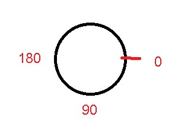
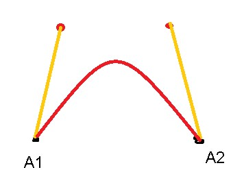

# **IeM - LAB** 

## **EVENT LISTENER**

void draw() --> 60 fps, modificabile con framerate (es: framerate(1)); 

il draw() è un loop infinito

```processing
line(x1, y1, x2, y2); //punti inizio e fine
```

```processing
    int x; 
    void setup(){
    size(500, 500); 
    x=0; 
    }

    void draw(){
    line(x, 0, x, height); 
    x++; 
    }

```
--> l'animazione funziona tipo animazioni vecchie disney-> occorre pulire la canvas e aggiornare tutto ad ogni frame<br>

velocità = pixel a frame; <br>
es: v=3; --> x+=v;<br>


//direzione + velocità
```processing
    int x;  
    int dir = +1; 
    int v =10; 
    void setup(){
    strokeWeight(20); 
    size(500, 500); 
    x=500; 
    }

    void draw(){
    background(255, 255, 255); 
    line(x, 0, x, height); 
    x+=v*dir;
    }
```

//rimbalzante
```processing
int x;  
int dir = +1; 
int v =10; 
void setup(){
  strokeWeight(20); 
  size(500, 500); 
  x=0; 
}

void draw(){
  background(255, 255, 255); 
  line(x, 0, x, height); 
  if(x>=width || x< 0){
    dir = -(dir);
  }  
    x+=v*dir;
}
```

//due linee rimbalzanti + che scompaiono
```processing
int x;  
int dir = +1; 
int v =10; 
int col = 0; 
void setup(){
  strokeWeight(20); 
  size(500, 500); 
  x=0; 
}

void draw(){
  stroke(col, col, col); 
  background(255, 255, 255); 
  line(x, 0, x, height); 
  line(0, x, width, x); 
  if(x>=width || x< 0){
    dir = -(dir);
    col= col+30; 
  }  
    x+=v*dir;
  
}
```


//FUNZIONE ARC
```processing
    arc(x1, y1, angleBegin, angleEnd);
```

//per processing gli angoli iniziano a 90° della circonferenza --> crescono in senso orario



COSTANTI: 
  PI, HALF_PI, QUARTER_PI, TWO_PI
  

//pacman con occhio e palline
```processing
  int x;  
  int dir = +1; 
  int v =10; 
  int va =2; 
  int dira =1; 
  int a = 30; 
  void setup(){
    strokeWeight(20); 
    size(500, 500); 
    noStroke(); 
    fill(255, 255, 0); 
    x=51; 
  }

  void draw(){
    background(0, 0, 0); 
    fill(255, 255, 255); 
    for(int j =30; j<height; j+=50){
    circle(j, width/2, 20); 
    }
    
    
    if(dir>0){
    
    fill(255, 255, 0);
    arc(x, height/2, 100, 100, radians(a), radians(360-a)); 
    fill(0); 
    circle(x, (height/2)-20, 20);
    }else{
    fill(255, 255, 0);
    arc(x, height/2, 100, 100, radians(180+a), radians(360+180-a)); 
    fill(0); 
    circle(x, (height/2)-20, 20);
    }
    
    if(a>30 || a<=0){
    dira =-dira; 
    }
    
    if(x>=width-50 || x<50){
      dir = -(dir);
    }  
      x+=v*dir;
      a+=va*dira; 
    
  }
```


### **ARCMODE**

open -- chord -- pie<br>

### **BORDER RADIUS DEL RECT**

rect(x1, y1, x2, y2, BORDER_RADIUS);<br>
rect(x1, y1, x2, y2, BR1, BR2, BR3, B4); // diversi border radius per ogni angolo<br>

***

## **FIGURE GENERICHE > 4 VERTICI**

beginShape();<br>
vertex(x, y); //<--- mi segno le coordinate tipo su paint segna la posizione del mouse<br>  
endShape(); // <--- posso passare come parametro CLOSE per chiudere automaticamente<br>


//figura SHAPE che cade
```processing
  
void setup(){
  size(500, 500); 
}

void draw(){
background(0); 
beginShape(); 
vertex(180, y+82); 
vertex(207, y+36); 
vertex(214, y+63); 
vertex(407, y+11); 
vertex(412, y+30); 
vertex(219, y+82); 
vertex(226, y+109);  
endShape(CLOSE); 
y+=20; 
}
```

//figura SHAPE che rimbalza
```processing
int y =0;
int dir = 1; 
void setup(){
  size(500, 500); 
}

void draw(){
background(0); 
beginShape(); 
vertex(180, y+82); 
vertex(207, y+36); 
vertex(214, y+63); 
vertex(407, y+11); 
vertex(412, y+30); 
vertex(219, y+82); 
vertex(226, y+109);  
endShape(CLOSE); 
y+=20*dir;
if(y>500-109||y<0){
  dir = -(dir); 
}
}
```

***

## **CURVE DI BEZIER**



**----> INSERIRE LA GIF DEL PROF DEI PUNTI DI ANCORAGGIO <-------**

* utilizzate per rappresentare qualunque curva utilizzando punti di ancoraggio<br>
* da qualunque programma grafico

//bezier interattiva
```processing
void setup(){
    size(500, 500); 
}

void draw(){
    background(255, 255, 255); 
    strokeWeight(1);
    stroke(0); 
    bezier(50, height/2, 100, 100, mouseX, mouseY, 450, height/2); 
    stroke(0, 0, 255); 
    strokeWeight(2);
    line(50, height/2, 100, 100); 
    line(mouseX, mouseY, 450, height/2); 
    stroke(255, 0,0); 
    strokeWeight(10); 
    point(50, height/2); 
    point(450, height/2); 
    stroke(0, 255, 0); 
    
    stroke(0, 255, 0); 

    point(100, 100); 
    point(mouseX, mouseY); 
}
```

***

## **interazione**

per controllare che il puntatore sia dentro un cerchio
--> controllo la distanza dal centro, che rientri dentro il cerchio

DIST(x1, y1, mouseX, mouseY); 

per un rettangolo invece è come fare un sistema in due equazioni

//pallini interattivi
```processing
  int q = 10; 
  int d; 

  void setup(){
  size(500, 500);
  background(width); 
  d = width/q; 
  noStroke(); 
  colorMode(RGB, width); //cambia il range di valori del colore (default = [0, 255]) 
                          //utile anche [0, 1] per le percentuali
  }

  void draw(){
    
    for(int y = d/2; y<= height; y+=d){
      for(int x = d/2; x<= height; x+=d){
          if(dist(x, y, mouseX, mouseY)<=d/2){
            fill(x, y, width); 
            ellipse(x, y, d, d); 
          }else{
            fill(x, y, 0); 
            //ellipse(x, y, d, d);
          }
        }
    }
  }
```

***

### **texture**

creare una texture
mattonelle con "sfasamento up and down"
sfondo verde e mattonelle con tonalità di grigio trasparente

```processing
    int q = 20; 
    int d; 

    void setup(){
        size(500, 500); 
        d=width/q; 
        noStroke();
        noLoop(); 
    }

    void draw(){
        background(255, 0, 0); 
        for(int y = 0; y<= height; y+=d){
            for(int x=0; x<=width; x+=d){
                fill(random(255), 130); 
                rect(x+random(-5, 5), y+random(-5, 5), d, d); 
            }
        }
    }
```

le sovrapposizioni -> sono due semitrasparenti che diventano opachi e totalmente coprenti
//posso o sommarli oppure scegliere il maggiore dei due oppure scegliere una trasparenza tale che sovrapposti non vadano oltre 255

### ES --> 4 quadranti

