# **IeM -- 7**


Acquisizione di una immagine

## **SENSORE** 

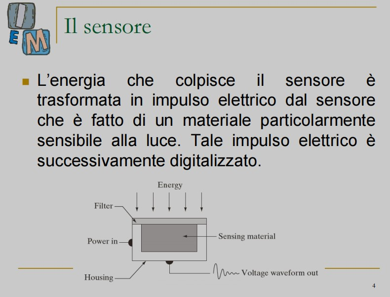

--> Energia che attraversa la lente/filtro e colpisce il sensore (materiale sensibile) che trasforma l'impulso ricevuto in un numero

TEORICAMENTE (non in realtà) possiamo ipotizzare che ad un sensore memorizzi un pixel (in realtà il sensore è troppo grande per un pixel)

più sensori ci sono --> maggiore è la risoluzione

### **CCD** 

sensori disposti a matrice --> vengono portati nella memoria attraverso un "bus"

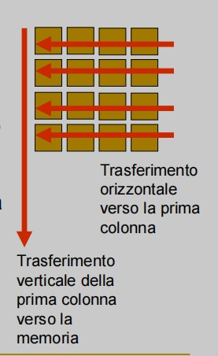

tutto questo accade istantaneamente dopo il clic.

Questo è per le immagini 2D: --> Ma per esempio le TAC funzionano diversamente. I raggi attraversano il corpo e ciò che passa dall'altra parte viene memorizzato

Creare le immagini --> non sempre fatto allo stesso modo, da qui in poi pensiamo al metodo macchina fotografica

--> ES: SCANNER

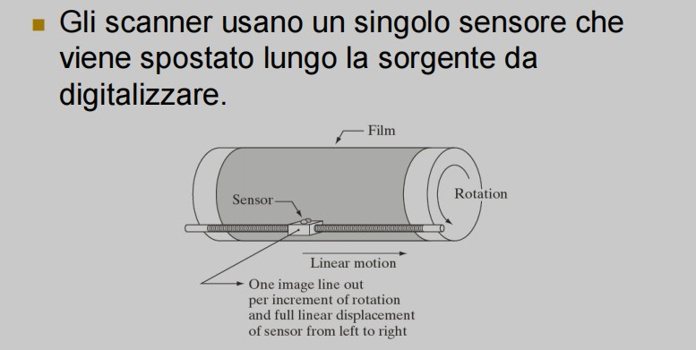

**alla fine bisogna comunque buttare ciò che abbiamo ricavato dentro ad una matrice** 

***

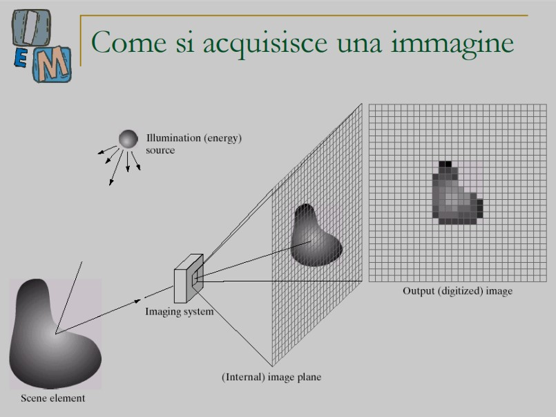
<br>
^--- i sensori non sono raffinati come l'occhio: perché possiamo vedere tutto lo spettro del visibile. Non in contemporanea (es: il range di luce e ombra) ma riesce. Per i sensori no. SI organizzano in base alle lunghezze d'onda che riescono ad immagazzinare

Su asse cartesiano, si scompone sulla lunghezza d'onda Lambda --> alcuni sensori colgono meglio quelle corte, altri quelle medie, o lunghe.

### **Organizzare le lunghezze d'onda**

    (corte-- diminuisce lambda)                           (lunghe-- aumenta lambda)
        | ----- || --------| ------- | ------- ||--------> 
            1         B         G        R          2

**1 --> ultravioletti**  
**2 --> infrarossi**
<br>
lambda = LUNGHEZZA D'ONDA

***

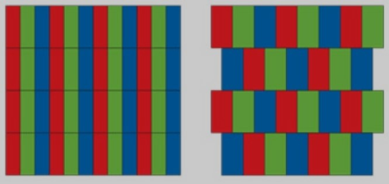
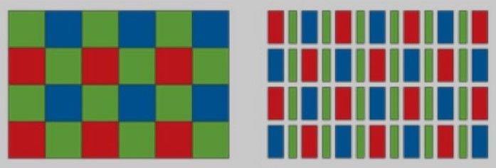
Avendo una matrice: come disporre i sensori RGB in una matrice??

1) Matrice disposta in sequenze di RGB
2) Rettangoli shiftati (meglio! ogni colore è meno distante da ogni punto)

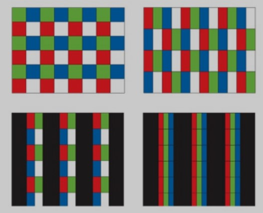

Sensori più sofisticati: il bianco è un sensore più sensibile che prende una porzione maggiore
Oppure posso anche lasciare delle aree senza acquisire


prendere anche sensori bianchi rende l'immagine più nitida

***

## **BAYER PATTERN**

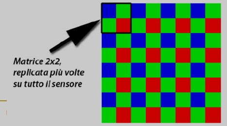

* Sviluppato da B.Bayer nel 1976
* Divido la matrice in blocchi da 2x2
* Due regole: due verdi, e questi due verdi devono stare in diagonale
* Rapporto 1:2:1 -- R:G:B

        [R][G]  [G][R]   [G][B]      
        [G][B]  [B][G]   [R][G]  

        ^-- tutti leciti

* ma una volta che stabilisco un pattern, devo ripetere quello  
* posso specificare il primo pixel (1,1) e il resto "si capisce" seguendo la regola  

* per ogni pixel, ci sono delle lunghezze d'onda che si perdono inevitabilmente --> perché ho un sensore particolare per ogni cella della matrice. Prendo 1/3 per ogni sensore.  

* Quindi per tutti i raggi solo alcuni colpiscono l'oggetto --> poi poche di quelle vengono riflesse --> di quelle, poche colpiscono la lente --> di queste, prendo solo 1/3 per ogni sensore

* allora come funziona?
  * Le informazioni che mancano posso "inserirle" /"interpolarle" attraverso algoritmi (**COLOR INTERPOLATION**)
  * La approssimazione è molto piccola e l'occhio non la nota  <br><br>

* Il bayer pattern dice con quale **schema** posizionare i sensori  (il più diffuso)
* E' anche detto CFA --> **COLOR FILTER ARRAY** 

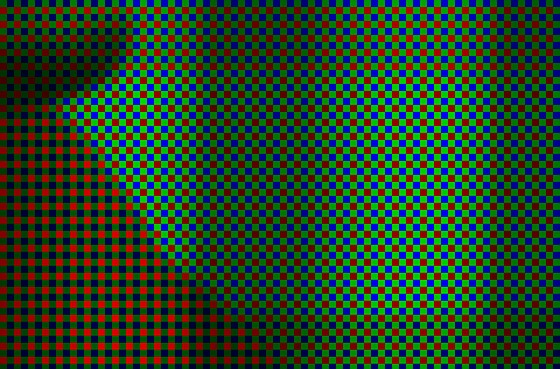
* **^---- FALSI COLORI, completando la terna con gli zeri dove non ho valori del colore mancante---^**

* Nelle macchine digitali professionali posso specificare di rendermi la immagine acquisita col bayern patter --> immagine acquisita GREZZA senza interpolazione, se voglio applicare io l'interpolazione
  
* formato RAW --> prima della interpolazione, grezzo.
  * Ogni macchina fotografica ha il proprio formato raw
  * Il formato in raw occupa più spazio

* **Ogni blocco 2x2 è un pixel????**

* In realtà ogni singolo sensore --> viene in grigio [0-255]

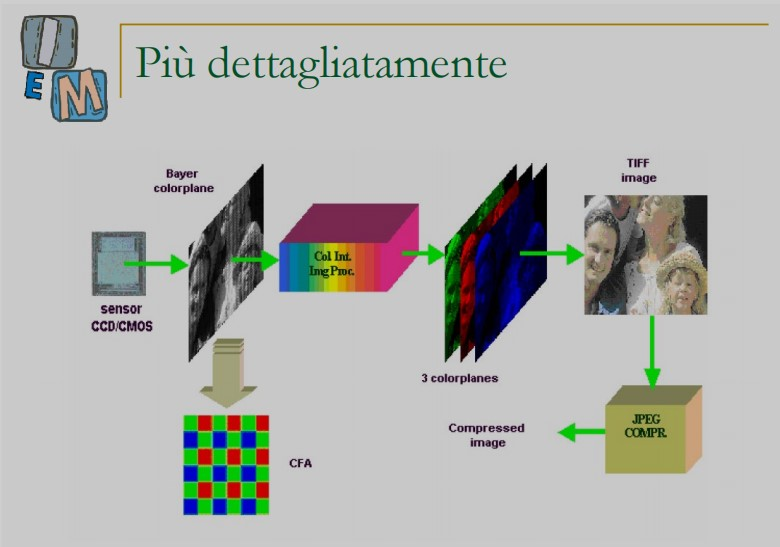

***

### **Primo modello macchina fotografica**

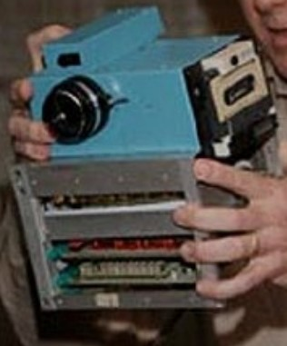
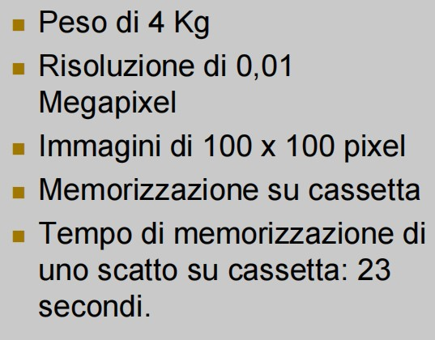  

* Steven Sasson 1975, brevetto alla Kodak (che nasceva come azienda di pellicole cinematografica

***

### **COLOR INTERPOLATION**

dal raw del bayer pattern --> si creano tre immagini della grandezza dell'immagine di partenza (per il R, per il G, per il B), ma ognuna di queste matrici avrà degli spazi vuoti perché non c'è informazione

Applico interpolazione per trovare le informazioni e riempire i "Buchi" di colore

Sono di tre tipi --> come la interpolazione di prima

**1) Replication -- nearest neighbour**

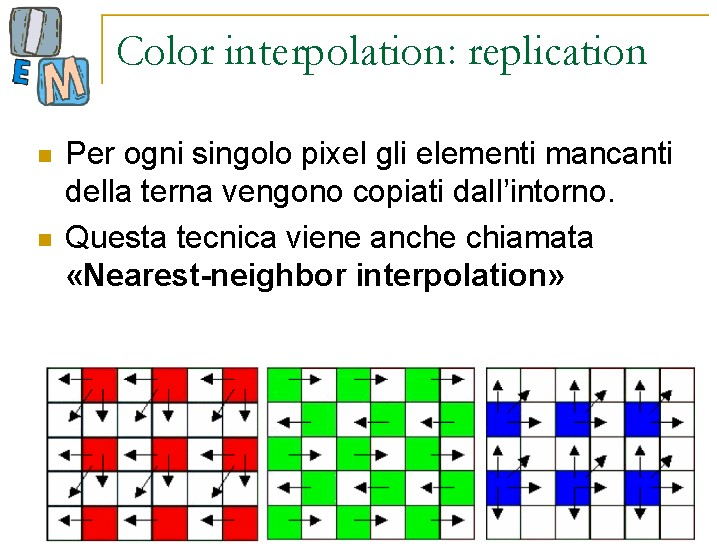


**2) Bilineare** 

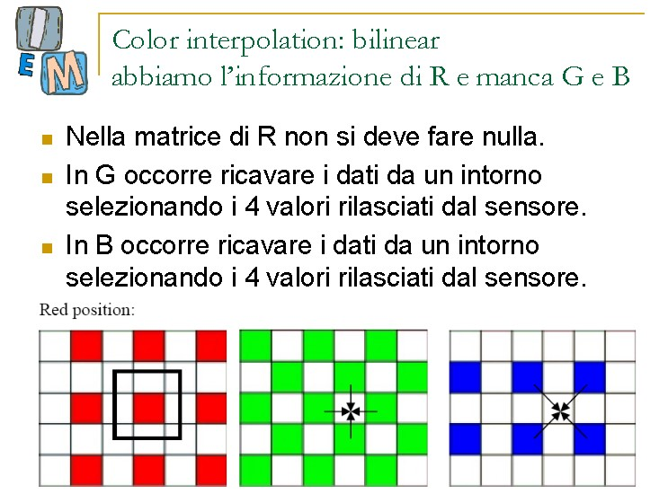

(c'è anche bicubico)

***

btw photoshop apre i crw (raw delle canon e altre macchine fotografiche) e ti fa scegliere come trasporlo/interpolarlo in RGB

***

      Per creare il finto bayer pattern (in scala di grigio)

```matlab
    clear all
    close all

    I=double(imread('lena.jpg')); 
    figure imshow(uint8(I));

    %%% G R 
    %%% B G

    [m n] = size(I); 
    O = zeros(m,n);
    O2 = zeros(m, n, t); %% in tre dimensioni -- la matrice tridimensionale per il colore

    for i = 1:m
      for j= 1:n
        if(mod(i, 2)==0 & mod(j, 2)==0 | (mod(i,2)~=0 & mod(j,2)~=0)) %%% riga e colonna entrambe pari o entrambe dispari (POSIZIONE DI VERDE)
            O(i, j) = I(i, j, 2);
            O2(i, j, 2) = I(i, j, 2); %% <---- colore
        else if(mod(i, 2)~=0 & mod(j, 2)==0) %% riga dispari, colonna pari
            O(i, j) = I(i, j, 1); 
            O2(i, j, 1) = I(i, j, 1); %% <---- colore
        else
            O(i, j) = I(i, j, 3); 
            O2(i, j, 3) = I(i, j, 3); %% <---- colore
        end
      end
    end

  figure, imshow(O, []), title('Bayer pattern');
  figure, imshow(uint8(O2, [])), title('Bayer pattern in falsi colori');  %% forzatura <-- completo le terne con degli zeri

```


***

## **Recupero della parte mancante della lezione 6 -- PSNR** 

  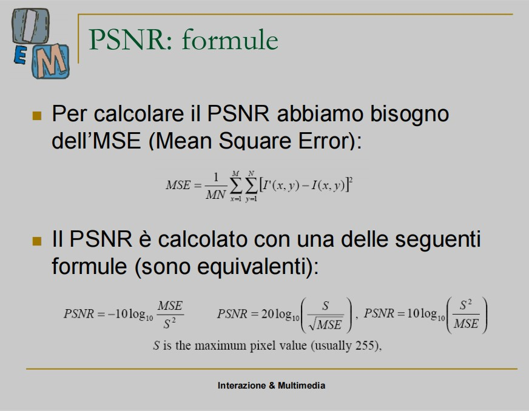

      implementazione dell'algoritmo per calcolare il PSNR
      (utilizzando immagine di lena + lena sfocata)

```matlab
  I = double(rgb2gray(imread('lena.jpg'))); 
  
  [m n] = size(I); 

  I2 = double(rgb2gray(imread('lena_sfocata.jpg'))); 
  figure, imshow(uint8(I2), []); 

   %% mettiamo il "puntino" perché vogliamo la moltiplicazione di ogni numero dentro il punto e non l'elevazione al quadrato della matrice
   %% poi mettiamo la radice
   %% vogliamo fare la sommatoria = quindi vogliamo la somma delle colonne della righe
   %% quindi una doppia sommatoria
  MSE = (sum(sum(I-I2).^2)))/(m*n);
  PSNR = -10*log10(MSE/(255^2)); 

```

**se non avessimo l'immagine di partenza?**

* Esempio <-- zooming. non sarà delle stesse dimensioni
* Farò un subsampling  
*  

```matlab
  I = double(rgb2gray(imread('lena.jpg'))); 
  
  [m n] = size(I); 

  I2=imresize(I, 0.5, 'nearest'); 
  % I2 = double(rgb2gray(imread('lena_sfocata.jpg'))); 
  figure, imshow(uint8(I2), []); 

  I3 = imresize(I2, 2, 'nearest'); %% quando rimpicciolisco e poi ingrandisco con il nearest NON saranno le stesse immagini! data loss!!!

   %% mettiamo il "puntino" perché vogliamo la moltiplicazione di ogni numero dentro il punto e non l'elevazione al quadrato della matrice
   %% poi mettiamo la radice
   %% vogliamo fare la sommatoria = quindi vogliamo la somma delle colonne della righe
   %% quindi una doppia sommatoria
  MSE = (sum(sum(I-I3).^2)))/(m*n);
  PSNR = -10*log10(MSE/(255^2)); 

```

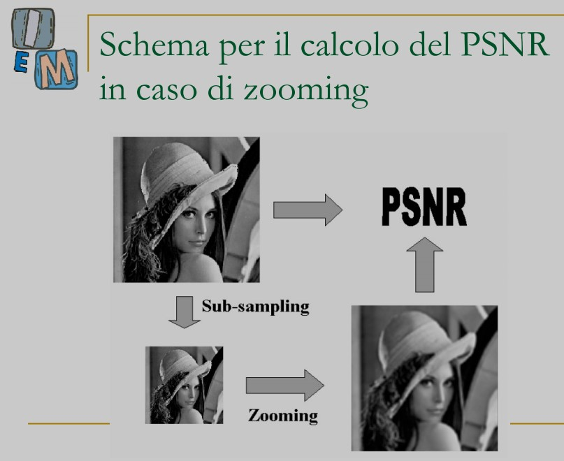

* decimazione col nearest = il PSNR è 25 con il nearest, 27 col bilineare, il bicubico 26!!

* se faccio decimazione col bilineare, l'ingrandimento col nearest = 27; quello col bilineare = 28; quello col bicubico = 29

* un pro del nearest è che **non creo valori nuovi**. Nel bilineare e bicubico invece faccio delle medie
* Il MSE fa un pixel - un pixel. ci sarà un momento in cui un pixel viene sottratto a sé stesso --> quindi ci sarà zero e quindi fanno abbassare il MSE che quindi fa crescere il PSNR
* Questa cosa si ripercuote su bilineare --> se c'è stato il nearest ci sono molti zeri nella sommatoria!
* La replication FALSA il risultato, perché ogni 4 numeri almeno uno sarà a zero. Un terzo dei numeri va a zero --> cambia il risultato finale
* Numericamente viene un numero, visivamente ne viene un altro
* Il PSNR è il più usato ma non è per niente il migliore algoritmo: uno migliore per esempio è l'ES.Sim? Che si studia alla magistrale
* 